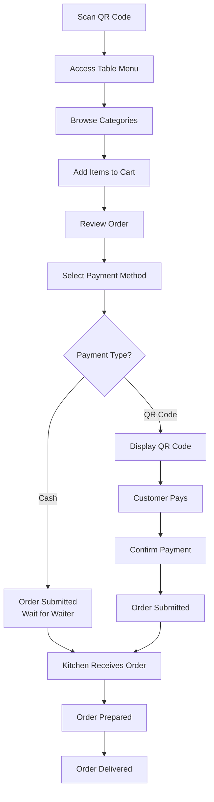
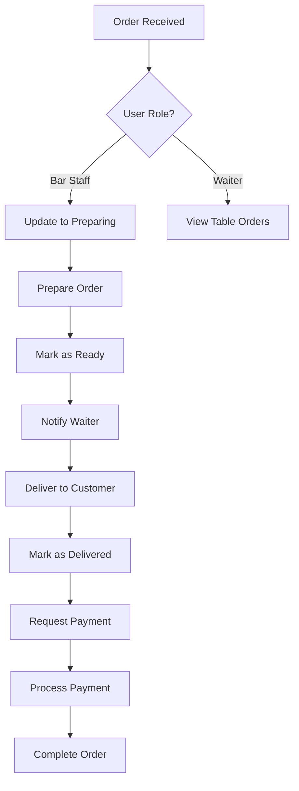
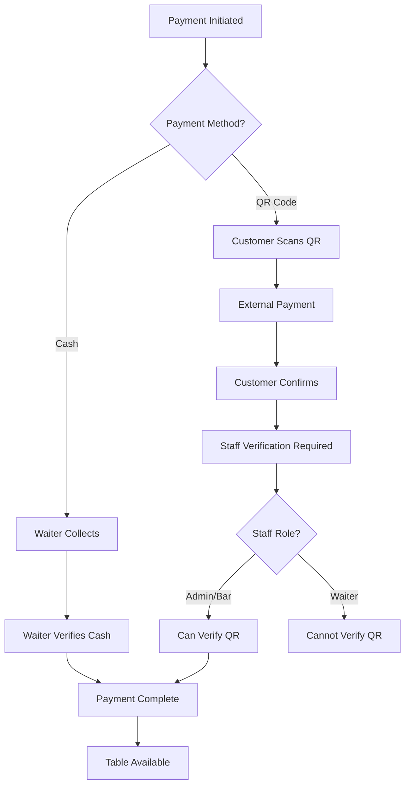

# 🍹 BarFlow - Complete Bar Management System

[](https://www.typescriptlang.org/)
[](https://nextjs.org/)
[](https://nestjs.com/)
[](https://www.postgresql.org/)
[](https://www.docker.com/)

A comprehensive bar and restaurant management system with QR code ordering, real-time order tracking, payment processing, and role-based access control. Built with modern web technologies for optimal performance and user experience.

## 📋 Table of Contents

- [Overview](#-overview)
- [Features](#-features)
- [Architecture](#-architecture)
- [Technology Stack](#-technology-stack)
- [Quick Start](#-quick-start)
- [Project Structure](#-project-structure)
- [User Roles & Permissions](#-user-roles--permissions)
- [Core Workflows](#-core-workflows)
- [API Documentation](#-api-documentation)
- [Database Schema](#-database-schema)
- [Configuration](#-configuration)
- [Development](#-development)
- [Deployment](#-deployment)
- [Contributing](#-contributing)
- [License](#-license)

## 🎯 Overview

BarFlow is a modern, full-stack bar and restaurant management system designed to streamline operations from customer ordering to payment processing. The system features a customer-facing QR code ordering interface, comprehensive staff management tools, and real-time order tracking capabilities.

### Key Benefits

- **📱 Customer Self-Service**: QR code-based ordering system eliminates wait times
- **⚡ Real-time Operations**: Live order tracking and status updates across all roles
- **🔐 Role-based Access**: Granular permissions for admins, bar staff, and waiters
- **💳 Multiple Payment Methods**: Support for cash and QR code payments
- **📊 Comprehensive Management**: Inventory, tables, orders, and payment management
- **🎨 Modern UI/UX**: Responsive design with intuitive interfaces

## ✨ Features

### 🛍️ Customer Features
- **QR Code Ordering**: Scan table QR codes to access menu and place orders
- **Digital Menu**: Browse categorized inventory with images and prices
- **Shopping Cart**: Add/remove items with quantity management
- **Payment Options**: Choose between cash payment or QR code payment
- **Order Status**: Real-time updates on order preparation and delivery
- **Receipt Generation**: Digital receipts with order details

### 👨‍💼 Admin Features
- **Complete System Control**: Full access to all system functions
- **User Management**: Create and manage staff accounts with role assignments
- **Inventory Management**: Add, edit, and track products with stock levels
- **Table Management**: Configure tables with QR codes and waiter assignments
- **Order Oversight**: View and manage all orders across the establishment
- **Payment Verification**: Approve all payment types and methods
- **Analytics Dashboard**: Comprehensive business insights and reporting

### 🍺 Bar Staff Features
- **Order Queue**: View pending orders requiring preparation
- **Status Management**: Update order status (preparing, ready, delivered)
- **Payment Processing**: Verify and approve all payment types
- **Inventory Alerts**: Low stock notifications and management
- **Real-time Updates**: Live order notifications and status changes

### 🧑‍🍳 Waiter Features
- **Table Assignment**: Manage assigned tables and customer interactions
- **Order Management**: View orders from assigned tables only
- **Payment Collection**: Verify cash payments from assigned tables
- **Table Status**: Update table availability and cleanliness status
- **Customer Service**: Direct interaction with customers for order fulfillment

## 🏗️ Architecture

BarFlow follows a modern microservices-inspired architecture with clear separation of concerns:

```
┌─────────────────┐    ┌─────────────────┐    ┌─────────────────┐
│   Frontend      │    │    Backend      │    │   Database      │
│   (Next.js)     │◄──►│   (NestJS)      │◄──►│ (PostgreSQL)    │
│                 │    │                 │    │                 │
│ • React 18      │    │ • REST API      │    │ • TypeORM       │
│ • TypeScript    │    │ • JWT Auth      │    │ • Migrations    │
│ • Tailwind CSS  │    │ • Guards        │    │ • Relations     │
│ • React Query   │    │ • Validation    │    │ • Indexes       │
└─────────────────┘    └─────────────────┘    └─────────────────┘
         │                       │                       │
         └───────────────────────┼───────────────────────┘
                                 │
                    ┌─────────────────┐
                    │ External Services│
                    │                 │
                    │ • Azure Blob    │
                    │ • QR Codes      │
                    │ • File Storage  │
                    └─────────────────┘
```

## 🛠️ Technology Stack

### Frontend
- **Framework**: Next.js 15.5.3 with App Router
- **Language**: TypeScript 5
- **Styling**: Tailwind CSS with Headless UI
- **State Management**: React Query (TanStack Query)
- **HTTP Client**: Axios with interceptors
- **Icons**: Heroicons
- **Build Tool**: Turbopack for development

### Backend
- **Framework**: NestJS with TypeScript
- **Database ORM**: TypeORM with PostgreSQL
- **Authentication**: JWT with Passport
- **Validation**: Class Validator & Class Transformer
- **Documentation**: Swagger/OpenAPI
- **File Storage**: Azure Blob Storage integration

### Database
- **Primary**: PostgreSQL 14+
- **Features**: JSONB support, full-text search, advanced indexing
- **Migrations**: TypeORM migration system
- **Seeding**: Custom seed scripts for development data

### DevOps & Tools
- **Package Manager**: npm
- **Version Control**: Git with conventional commits
- **Code Quality**: ESLint, Prettier
- **Environment**: Docker & Docker Compose support

## 🚀 Quick Start

### Prerequisites

- Node.js 18+ and npm
- PostgreSQL 14+
- Git

### Installation

1. **Clone the repository**
   ```bash
   git clone https://github.com/yourusername/BarFlow.git
   cd BarFlow
   ```

2. **Install dependencies**
   ```bash
   # Install backend dependencies
   cd backend
   npm install
   
   # Install frontend dependencies
   cd ../frontend
   npm install
   ```

3. **Database Setup**
   ```bash
   # Create PostgreSQL database
   createdb barflow_db
   
   # Run migrations
   cd ../backend
   npm run migration:run
   
   # Seed initial data
   npm run seed
   ```

4. **Environment Configuration**
   ```bash
   # Backend (.env)
   cd backend
   cp .env.example .env
   # Configure your database and JWT settings
   
   # Frontend (.env.local)
   cd ../frontend
   cp .env.example .env.local
   # Configure API URLs
   ```

5. **Start Development Servers**
   ```bash
   # Terminal 1: Start backend
   cd backend
   npm run start:dev
   
   # Terminal 2: Start frontend
   cd frontend
   npm run dev
   ```

6. **Access the Application**
   - Frontend: http://localhost:3000
   - Backend API: http://localhost:4000/api
   - API Documentation: http://localhost:4000/api-docs

### Default Users

After seeding, you can login with:

```
Admin:
- Username: admin
- Password: admin123

Bar Staff:
- Username: barstaff1
- Password: barstaff123

Waiter:
- Username: waiter1
- Password: waiter123
```

## 📁 Project Structure

```
BarFlow/
├── frontend/                 # Next.js Frontend Application
│   ├── src/
│   │   ├── app/             # App Router pages
│   │   │   ├── dashboard/   # Admin dashboard
│   │   │   ├── inventory/   # Inventory management
│   │   │   ├── orders/      # Order management
│   │   │   ├── payments/    # Payment processing
│   │   │   ├── tables/      # Table management
│   │   │   ├── table/       # Customer ordering interface
│   │   │   └── users/       # User management
│   │   ├── components/      # Reusable React components
│   │   ├── contexts/        # React contexts (Auth, etc.)
│   │   ├── lib/            # Utilities and configurations
│   │   ├── providers/       # React providers
│   │   └── types/          # TypeScript type definitions
│   ├── public/             # Static assets
│   └── package.json
│
├── backend/                 # NestJS Backend Application
│   ├── src/
│   │   ├── auth/           # Authentication module
│   │   ├── bars/           # Bar management
│   │   ├── config/         # Configuration files
│   │   ├── database/       # Database utilities and seeds
│   │   ├── inventory/      # Inventory management
│   │   ├── migrations/     # Database migrations
│   │   ├── orders/         # Order processing
│   │   ├── payments/       # Payment processing
│   │   ├── tables/         # Table management
│   │   ├── users/          # User management
│   │   └── waiters/        # Waiter-specific functionality
│   ├── package.json
│   └── tsconfig.json
│
├── docs/                   # Documentation
├── scripts/                # Utility scripts
└── README.md              # This file
```

## 👥 User Roles & Permissions

### 🔑 Admin (Full System Access)
- **User Management**: Create, edit, delete all user accounts
- **Inventory Control**: Full inventory management and pricing
- **Table Configuration**: Setup tables, QR codes, and assignments
- **Order Oversight**: View and manage all orders system-wide
- **Payment Authority**: Approve all payment types and amounts
- **System Settings**: Configure global system preferences
- **Analytics Access**: Complete business intelligence and reporting

### 🍺 Bar Staff (Operations Focus)
- **Order Processing**: View and update order preparation status
- **Payment Verification**: Approve both cash and QR code payments
- **Inventory Monitoring**: Track stock levels and receive alerts
- **Quality Control**: Ensure order accuracy before marking ready
- **Shift Management**: Handle order queue during operating hours

### 🧑‍🍳 Waiter (Table Service)
- **Assigned Tables**: Manage only tables assigned to the waiter
- **Order Tracking**: View orders from assigned tables only
- **Cash Payments**: Verify cash payments from assigned tables
- **Table Status**: Update table availability and cleanliness
- **Customer Interaction**: Direct customer service and support

### 👤 Customer (Self-Service)
- **Menu Browsing**: View available items with categories
- **Order Placement**: Add items to cart and submit orders
- **Payment Selection**: Choose between cash or QR payment
- **Order Tracking**: Monitor order status in real-time

## 🔄 Core Workflows

### 1. Customer Ordering Workflow



### 2. Staff Order Management



### 3. Payment Processing Flow



## 📚 API Documentation

### Authentication Endpoints

| Method | Endpoint | Description | Access |
|--------|----------|-------------|---------|
| POST | `/api/auth/login` | User authentication | Public |
| POST | `/api/auth/register` | User registration | Admin |
| GET | `/api/auth/profile` | Get user profile | Authenticated |

### Order Management

| Method | Endpoint | Description | Access |
|--------|----------|-------------|---------|
| GET | `/api/orders` | Get all orders | Staff |
| GET | `/api/orders/my-orders` | Get waiter's table orders | Waiter |
| POST | `/api/orders/customer` | Create customer order | Public |
| PATCH | `/api/orders/:id/status` | Update order status | Staff |

### Payment Processing

| Method | Endpoint | Description | Access |
|--------|----------|-------------|---------|
| GET | `/api/payments/pending` | Get pending payments | Admin/Bar |
| GET | `/api/payments/my-payments` | Get waiter table payments | Waiter |
| POST | `/api/payments/customer/initiate/:orderId` | Initiate customer payment | Public |
| PATCH | `/api/payments/:id/verify` | Verify payment | Staff |

### Table Management

| Method | Endpoint | Description | Access |
|--------|----------|-------------|---------|
| GET | `/api/tables` | Get all tables | Admin |
| GET | `/api/tables/my-tables` | Get waiter's assigned tables | Waiter |
| GET | `/api/tables/qr/:qrCode` | Get table by QR code | Public |
| PATCH | `/api/tables/:id/status` | Update table status | Staff |

### Inventory Management

| Method | Endpoint | Description | Access |
|--------|----------|-------------|---------|
| GET | `/api/inventory` | Get all inventory items | Staff |
| GET | `/api/inventory/public` | Get public menu items | Public |
| POST | `/api/inventory` | Create inventory item | Admin |
| PATCH | `/api/inventory/:id` | Update inventory item | Admin |

## 🗄️ Database Schema

### Core Entities

#### Users
```sql
CREATE TABLE users (
    id SERIAL PRIMARY KEY,
    username VARCHAR UNIQUE NOT NULL,
    password VARCHAR NOT NULL,
    role user_role_enum NOT NULL,
    created_at TIMESTAMP DEFAULT NOW()
);
```

#### Tables
```sql
CREATE TABLE tables (
    id SERIAL PRIMARY KEY,
    qr_code VARCHAR UNIQUE NOT NULL,
    waiter_id INTEGER REFERENCES waiters(id),
    status table_status_enum DEFAULT 'available',
    capacity INTEGER NOT NULL,
    location VARCHAR NOT NULL,
    created_at TIMESTAMP DEFAULT NOW(),
    updated_at TIMESTAMP DEFAULT NOW()
);
```

#### Orders
```sql
CREATE TABLE orders (
    id SERIAL PRIMARY KEY,
    table_id INTEGER REFERENCES tables(id),
    waiter_id INTEGER REFERENCES waiters(id),
    bar_id INTEGER REFERENCES bars(id),
    status order_status_enum DEFAULT 'pending',
    total_amount DECIMAL(10,2) NOT NULL,
    notes TEXT,
    created_at TIMESTAMP DEFAULT NOW(),
    updated_at TIMESTAMP DEFAULT NOW()
);
```

#### Payments
```sql
CREATE TABLE payments (
    id SERIAL PRIMARY KEY,
    order_id INTEGER REFERENCES orders(id),
    method payment_method_enum NOT NULL,
    status payment_status_enum DEFAULT 'pending',
    transaction_id VARCHAR,
    verified_by INTEGER REFERENCES users(id),
    created_at TIMESTAMP DEFAULT NOW(),
    updated_at TIMESTAMP DEFAULT NOW()
);
```

### Relationships

- **Users → Waiters**: One-to-One (waiters are users with waiter role)
- **Waiters → Tables**: One-to-Many (waiter can manage multiple tables)
- **Tables → Orders**: One-to-Many (table can have multiple orders)
- **Orders → OrderItems**: One-to-Many (order contains multiple items)
- **Orders → Payments**: One-to-One (each order has one payment)
- **Inventory → OrderItems**: One-to-Many (inventory item can be in multiple orders)

## ⚙️ Configuration

### Environment Variables

#### Backend (.env)
```env
# Database Configuration
DB_HOST=localhost
DB_PORT=5432
DB_USERNAME=barflow_user
DB_PASSWORD=barflow_password
DB_DATABASE=barflow_db

# JWT Configuration
JWT_SECRET=your-super-secret-jwt-key
JWT_EXPIRES_IN=24h

# Application Configuration
PORT=4000
NODE_ENV=development

# Azure Blob Storage (Optional)
AZURE_STORAGE_CONNECTION_STRING=your-azure-connection-string
AZURE_STORAGE_CONTAINER_NAME=barflowcontainer
```

#### Frontend (.env.local)
```env
# API Configuration
NEXT_PUBLIC_API_URL=http://localhost:4000/api
NEXT_PUBLIC_PUBLIC_API_URL=http://localhost:4000/api

# Application Configuration
NEXT_PUBLIC_APP_NAME=BarFlow
NEXT_PUBLIC_APP_VERSION=1.0.0
```

## 🔧 Development

### Setting up Development Environment

1. **Database Setup**
   ```bash
   # Using PostgreSQL locally
   createdb barflow_db
   
   # Or using Docker
   docker run --name barflow-postgres \
     -e POSTGRES_DB=barflow_db \
     -e POSTGRES_USER=barflow_user \
     -e POSTGRES_PASSWORD=barflow_password \
     -p 5432:5432 -d postgres:14
   ```

2. **Running Migrations**
   ```bash
   cd backend
   npm run migration:generate -- -n MigrationName
   npm run migration:run
   ```

3. **Development Scripts**
   ```bash
   # Backend
   npm run start:dev    # Start with hot reload
   npm run start:debug  # Start with debugger
   npm run test         # Run tests
   npm run test:watch   # Run tests in watch mode
   
   # Frontend
   npm run dev          # Start development server
   npm run build        # Build for production
   npm run lint         # Run ESLint
   npm run type-check   # Run TypeScript checks
   ```

### Code Quality

- **ESLint**: Configured with TypeScript and React rules
- **Prettier**: Code formatting with consistent style
- **Husky**: Git hooks for pre-commit validation
- **TypeScript**: Strict type checking enabled

### Testing

```bash
# Backend Testing
cd backend
npm run test              # Unit tests
npm run test:e2e          # End-to-end tests
npm run test:cov          # Coverage report

# Frontend Testing
cd frontend
npm run test              # Jest unit tests
npm run test:watch        # Watch mode
npm run cypress:open      # E2E tests with Cypress
```

## 🚀 Deployment

### Production Build

1. **Backend Production**
   ```bash
   cd backend
   npm run build
   npm run start:prod
   ```

2. **Frontend Production**
   ```bash
   cd frontend
   npm run build
   npm run start
   ```

### Docker Deployment

```bash
# Build and run with Docker Compose
docker-compose up --build

# Or individually
docker build -t barflow-backend ./backend
docker build -t barflow-frontend ./frontend
```

### Environment Setup

- Configure production database credentials
- Set secure JWT secrets
- Configure Azure Blob Storage for file uploads
- Set up SSL certificates for HTTPS
- Configure reverse proxy (Nginx recommended)

## 🤝 Contributing

We welcome contributions to BarFlow! Please read our contributing guidelines:

### Development Process

1. **Fork the repository**
2. **Create a feature branch**: `git checkout -b feature/amazing-feature`
3. **Make your changes** with appropriate tests
4. **Commit your changes**: `git commit -m 'Add amazing feature'`
5. **Push to the branch**: `git push origin feature/amazing-feature`
6. **Open a Pull Request**

### Code Standards

- Follow TypeScript best practices
- Write comprehensive tests for new features
- Update documentation for API changes
- Use conventional commit messages
- Ensure all CI checks pass

### Reporting Issues

Please use GitHub Issues to report bugs or request features:
- **Bug Report**: Include steps to reproduce, expected behavior, and environment details
- **Feature Request**: Describe the feature and its benefits
- **Documentation**: Report inaccuracies or suggest improvements

## 📄 License

This project is licensed under the MIT License - see the [LICENSE](LICENSE) file for details.

## 🙏 Acknowledgments

- **NestJS Team**: For the excellent backend framework
- **Vercel Team**: For Next.js and deployment platform
- **Heroicons**: For the beautiful icon set
- **Tailwind CSS**: For the utility-first CSS framework
- **TypeORM**: For the powerful database ORM

## 📞 Support

For support and questions:

- **Documentation**: Check this README and inline code comments
- **Issues**: Create a GitHub issue for bugs or feature requests
- **Discussions**: Use GitHub Discussions for general questions
- **Email**: contact@barflow.dev (if available)

---

**Built with ❤️ by the BarFlow Team**

*Making bar and restaurant management simpler, one order at a time.*